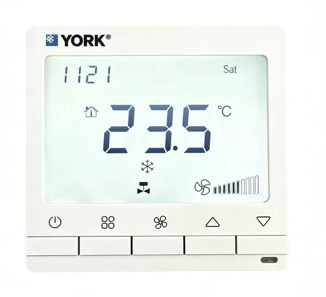
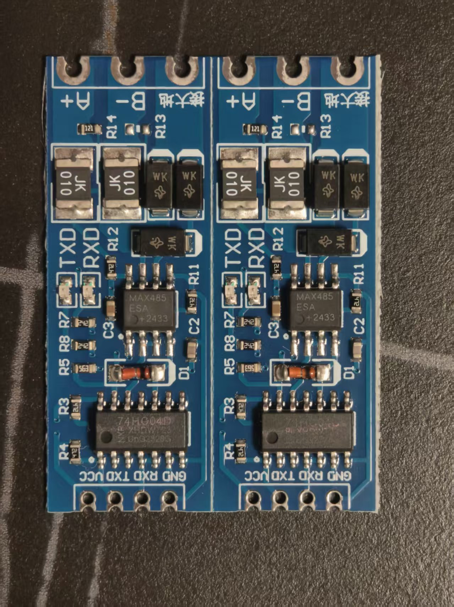

> [English](en/deployment.md) | **中文**

# 部署指南

> **动手前必读**：本项目源于个人家庭使用，虽然已稳定运行较长时间，但**不是工程化产品**，换个环境能否正常工作无法保证。动手涉及拆开面板、接线、取电，**接线错误、接错电压、误触都可能烧毁设备**（收发模块、ESP32 甚至面板）。请确认自己有足够的技术能力再开始，风险自担。

## 1. 物料清单

| 物品 | 说明 |
|---|---|
| ESP32-C3 开发板 | 一条总线一块；其他 ESP32 型号也可（需改 GPIO 引脚） |
| RS485 转 TTL 自动收发模块 | 板载 MAX485ESA + 74HC04D（见 §2），淘宝约 1 元/个，**建议多买几个备用** |
| DC-DC 降压模块 | 12V→3.3V/5V（如 mini560 / MP1584，几元钱），从面板内层 10p 线的 12V 取电（方式 B） |
| 交流转直流电源适配器 | 仅方式 A（不拆面板）需要，给 ESP32 供电 |
| 1.25mm 排线插头 / 细导线 | 从面板内层 10p 连接线引出 12V/GND/A/B |
| 服务器 | 任意 x86/ARM Linux，装 Docker，建议 7×24 运行 |

## 2. 硬件接线

数据（RS485）和电源有两种接法，按需选择：

| 方式 | 数据从哪引出 | 电源 | 是否拆开面板 |
|---|---|---|---|
| A | 面板背面预留的 RS485 接口（原为楼控/BMS 预留） | 外接"交流转直流"适配器 | 不用拆 |
| B（本方案采用） | 拆到内层，从 10p 连接线的 A/B 引出 | 同一条 10p 线的 DC 12V（经 DC-DC 降压） | 要拆到内层 |

本方案实测使用的面板为约克 MC2100（下图）：



**方式 B**：面板需要拆开两层：

1. 面板背面有厂家预留的 RS485 接口（原本留给楼控/BMS），但该处**只有交流电（AC）、没有 DC**，没法给 ESP32 供电
2. **再拆一层**（MCU 所在板层），可以看到一条 **10p、1.25mm 间距的连接线**，其中包含 **12V、GND、RS485 A/B**，以及面板对继电器的控制信号

从这条 10p 连接线中引出 **12V、GND、RS485 A、RS485 B** 四根：

- **12V** → DC-DC 降压模块转成 3.3V/5V，给 ESP32 和收发模块供电——**内层有 DC 12V，就不需要外接"交流转直流"的电源适配器，只要一个 DC-DC 降压即可**
- **A / B** → 接 RS485 转 TTL 模块的总线侧
- **GND** → 与降压模块、ESP32、收发模块共地（仅作电源地；差分信号本身无需接地处理）
- 收发模块 TTL 侧 **TXD → GPIO6（RX）**、**RXD → GPIO7（TX）**

```
   拆开面板到内层，从 10p 连接线中引出四根线（12V/GND/A/B）：

       12V ──────► [DC-DC 降压 12V→3.3V/5V] ──────► 给 ESP32 和收发模块供电
       GND ──────► 共地（ESP32、收发模块、降压模块）
       A  ──┐
       B  ──┴───► [RS485 转 TTL 模块] ──TXD/RXD──► ESP32 GPIO6/GPIO7
```

收发模块为 **RS485 转 TTL 自动收发模块**（板载 MAX485ESA + 74HC04D，自动切换收发方向，**无需单片机控制 DE/RE 脚**，固件只用 Serial1 收发）：



> 照片中拍了两个模块，实际一个 ESP32 配一个即可。淘宝约 1 元/个，**多备几个**——接线接错很容易把模块烧掉，换一个就能继续。

模块两侧引脚对应关系：

| 模块侧 | 引脚 | 接到 |
|---|---|---|
| TTL 侧 | VCC / GND | 降压模块输出（3.3V 或 5V，按模块要求） |
| TTL 侧 | TXD | ESP32 **GPIO6（RX）** |
| TTL 侧 | RXD | ESP32 **GPIO7（TX）** |
| 总线侧 | A / B | 面板排线的 A / B |

要点：

- **只监听时可只接 TXD**（模块的发送脚）；需要控制则 RXD 也要接
- **接线前务必确认 10p 线中 12V/GND/A/B 四根线的次序**（这条线排里还有面板对继电器的控制信号，不要接错），12V 接错会烧模块、甚至损伤面板
- RS485 是差分信号，引出线只有几厘米，**不会引入干扰，也不需要接地/屏蔽处理**，直接并联引出即可
- 注意 TXD 输出电平与单片机匹配（模块 5V 供电时 TXD 为 5V 电平，ESP32 建议 3.3V 供电或加电平转换）
- 若选择**方式 A**（不拆面板）：数据从背面预留的 RS485 口引出、ESP32 改用外接电源适配器供电，其余接线相同
- 拆开面板接线可能影响设备保修，请自行评估

### 面板地址（工程模式）

每台空调的面板从站地址通过 **MC2100 的工程模式**设置，安装空调时通常已经设好，正常无需改动（**数量随安装而定，本方案实测环境是 7 个面板、地址 1~7**）：

- **进入工程模式后，第一个值就是本面板的地址**
- 服务器解析出的 `dev_address` 就是它——地址决定数据和控制命令归属哪个房间
- 若某个地址长期没有数据，先确认面板地址在服务器接受的范围（默认 1~10）内、且没有与其他面板重复

## 3. 固件烧录

1. Arduino IDE 安装 ESP32 支持包（开发板管理器搜索 esp32）
2. 打开 `firmware/udp_to_modbus/udp_to_modbus.ino`
3. 修改文件顶部的配置：

```cpp
const char* ssid = "your_wifi_ssid";        // 你的 WiFi
const char* password = "your_wifi_password";
#define udpServerIP 192, 168, 1, 100        // 服务器地址
...
ArduinoOTA.setPassword("your_ota_password"); // 改成你自己的 OTA 密码
```

4. 选择开发板（如 `ESP32C3 Dev Module`）与串口，烧录
5. 串口监视器（115200）看到 `WiFi connecting....IP: x.x.x.x` 即成功
6. 设备后续可通过 ArduinoOTA 无线升级（网络端口里会出现 `acmon_wifiXXXX`）

## 4. 服务器部署

```bash
cd server
# 修改 docker-compose.yml：
#   your_db_password → 你想要的数据库密码
docker compose up -d
```

服务说明：

| 服务 | 端口 | 作用 |
|---|---|---|
| svr | UDP 12333（host 网络） | 接收网关数据、解析 Modbus 帧、入库 |
| websvr | 9950 → 容器 5000 | Web 查看与控制 |
| db | 127.0.0.1:5432 | PostgreSQL（首次启动自动建表） |

svr 使用 **host 网络**是为了保留网关的 UDP 源 IP——下发控制命令的寻址依赖它。

已有 PostgreSQL 时，改各服务的 db 地址即可。

## 5. 验证

```bash
# 1. 看解析日志，应持续打印 JSON 报文
docker compose logs -f svr

# 2. 浏览器打开 Web 界面，应看到各房间的实时状态
#    http://<服务器IP>:9950

# 3. 测试控制（把 2 号机的设定温度设为 25℃）
cd server/svr
python3 send_cmd.py <网关IP> 2 4 250
```

控制生效后，面板和 Web 界面会在下一次轮询时显示新状态。

## 6. 排查

| 现象 | 可能原因 |
|---|---|
| 服务器收不到数据 | 网关未连上 WiFi；服务器防火墙拦了 UDP 12333 |
| 日志出现乱码 / CRC mismatch | 波特率不是 9600；引线过长引入干扰（本方案几厘米短线不会有此问题）；电平未经过收发模块 |
| 改线后突然无数据 | 收发模块可能接线时已烧坏（非常常见），换一个备用模块再试 |
| Web 界面有状态但控制无效 | 命令是直发网关 IP 的（12335），确认网关 IP 与 `modbusclient` 表一致；两条命令间隔需 ≥5 秒 |
| 改了某个面板的模式又变回去 | 正常现象：1 号面板是主控，模式以其为准——切换模式请写 1 号面板 |
| 某台设备没有数据 | 该面板地址（工程模式第一个值）需在服务器接受范围且无重复；确认已参与总线轮询 |
| 数据明显滞后 | 状态只在变化时入库（设计如此），最后更新时间可在详情页查看 |

## 7. 安全提示

- Web 界面**没有登录鉴权**，请仅在信任的内网运行，不要暴露到公网
- 数据库密码、OTA 密码不要沿用示例值
